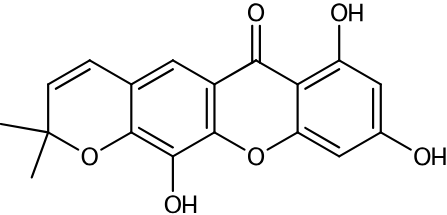
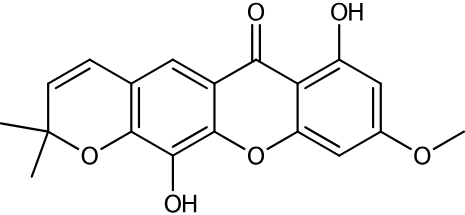

# Forbexanthone

A xanthone isolated from *Garcinia griffithii* T. Anderson (Clusiaceae) as published in [Biochemical Systematics and Ecology 116 (2024) 104869](https://doi.org/10.1016/j.bse.2024.104869).
The publication reports the 13C NMR chemical shifts of forbexanthone dissolved in C5D5N.

| Shift |
| *-----* |
| 164.5 |
| 98.2 |
| 167.2 |
| 93.4 |
| 158.7 |
| 134.3 |
| 148.0 |
| 119.6 |
| 113.3 |
| 115.7 |
| 181.5 |
| 104.3 |
| 147.5 |
| 122.5 |
| 132.2 |
| 78.6 |
| 28.6 |
| 56.4 |

These values were measured for the first time by the authors, even though forbexanthone is not a new compound.

The value 28.6 appears two times in the published list. It corresponds to two chemically equivalent nuclei and was not duplicated here.
This chemical shift list was submitted as a search key to [nmrshiftdb2](https://nmrshiftdb.nmr.uni-koeln.de).

The structure identified with the best similarity score (85%) is the one of [O-Demethylforbexanthone](https://www.wikidata.org/wiki/Q72513499).
This structure does not account for the presence of an aromatic methoxy group, the one at `$\delta$` 56.8.

The structure with the best second similarity score is (75%) is the one of [Forbexanthone](https://www.wikidata.org/wiki/Q104399389).

